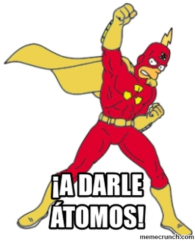

# Workshop: Test driven development (TDD)

Esto es una challenge para desarrollar tu skill con TDD!

Nuestro cliente es un loquito y cambia los requerimientos en base a su descubrimiento, nos tenemos que adaptar a sus necesidades (todospu) constantemente, teniendo en mente que sera un proyecto de varios años... si no lo prendemos fuejo!

El ejercicio cuenta con varias etapas ("requerimientos") y tambien fases, te recomiendo no "spoilearte" e ir construyendo en base a vayas leyendo.

Sobre las fases:
1) Sin test, directo a programar.
2) Con unit test primero ([TDD](https://es.wikipedia.org/wiki/Desarrollo_guiado_por_pruebas)).

## Instalacion
Requerido: 
* [NodeJs & NPM](https://nodejs.org/es/)
* git

Clonar: `git clone https://github.com/crystian/TDD`   
Instalar dependencias: `npm i`

 

### Requerimiento 1 (15')
"Te contrate para hacer una tabla"
  
* Hacer una table tipica en html de 4 x 4
* Nuestro diseñador ya te dejo todos los estilos hechos, no hace falta que hagas ninguno.
* Las celdas del borde deben estar pintadas de rojo (usar class `limit` en el `td`)
* Para identificar cada celda, ponerle id concatenado: `"cell" + row + "-" + col` (`cell0-0`)
* El contenido de cada celda sera su propia coordenada ("0-0")

### Requerimiento 2 (15')
15' despues: "Sabes que, mejor hagamos que se pueda cambiar el tamaño"

* Hacer que la tabla se cree con javascript [vanilla](http://vanilla-js.com/), en "global" esta bien.
* Escribi tu codigo javascript en: `index.js`
* No borrar la tabla anterior.

### Requerimiento 3 (10')
15' despues: "Sabes que, mejor pongamosla en una funcion porque lo vamos a usar en varios lados..."

* Encapsular toda la logica en una funcion `createTable` que acepte como parametros: Rows y Cols. 
* Saquemos los limites, que sea toda "normal" (asignar este `class`)

### Requerimiento 4 (20')
10' despues: "umm, mejor volvamos a agregar los limites"

* Agregar limites, pero esta vez sera tambien enviado por parametros la cantidad.
  * Ejemplo: 4 rows + 2 limites = 8 celdas de alto (no me equivoque! multiplica por dos el limite, uno para arriba y otro para abajo, lo mismo derecha e izquierda)
* Borrar primer tabla de html.

### Requerimiento 5 (40')
20' despues: "Acabo de tener una [epifania!](https://es.wikipedia.org/wiki/Epifan%C3%ADa), que tal si tenemos una celda verde que el usuario pueda mover!"

* Pintar una celda de verde (usar el class `selected`).
* Solo una de las celdas puede estar pintada de verde.
* Que el usuario pueda "mover" la celda utilizando el cursor del teclado (flechitas)
* Importante: El movimiento de la celda verde debe limitarse, no puede desaparecer! (si llega al maximo debe quedar ahi).
* Mas importante: La celda verde no puede solaparse con la roja! solo se puede desplazar en grises 

### Requerimiento 6
40' despues: "Jugaste al juego 'portal'? bueno, hagamos que se teletransporte!"

* Al superar un limite el verde debera reaparecer en el lado opuesto.
	* Si se "va" por arriba debera aparecer en la primer celda de abajo de la misma columna

## Pausa

Ya fueron dos horas, tomate una pausa y prepara mate/te o lavate la cara!

## TDD

Retro sobre la situacion anterior.

Tools:
* karma: executor
* mocha: framework
* chai: assertion

Vamos a contruir algo solido para que dure en el tiempo con la menor cantidad de horas de mantenimiento que podramos.

Ya no lo llamaremos tabla, lo llamaremos "engine".

Volvamos al principio, pero esta vez con TDD.

